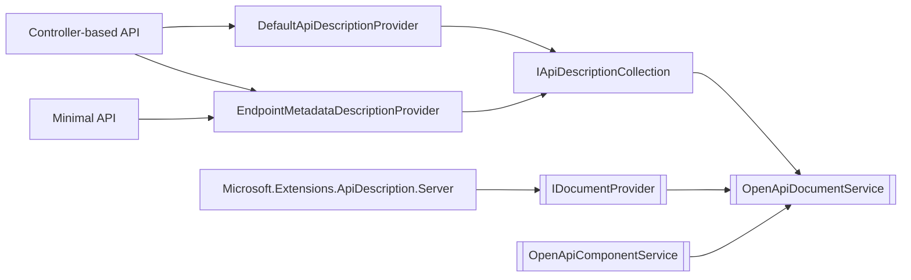

# OpenAPI in .NET
## Past, Present, and Future

---

# A look behind the code...

```csharp
var builder = WebApplication.CreateBuilder();

builder.Services.AddOpenApi();

var app = builder.Build();

if (app.Environment.IsDevelopment())
{
    app.MapOpenApi();
}

app.MapGet("/", () => "Hello world!");

app.Run();
```

---

# ...into the implementation...



---

# ...and the history...

---

# ...and the future!

---