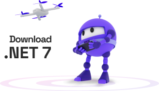

# openapi in .net
# past, present, and future
## safia abdalla | principal software engineer | microsoft

<!-- good afternoon, everyone! my name is safia abdalla and i'm an engineer on the asp.net core team at microsoft and i am here to talk to you about the past, present, and future of openapi in .net. if you don't know what openapi is, don't worry you'll learn all about it in the course of this talk. and if you do know what openapi is, you'll hopefully learn some interesting new context from this presentation. -->

---
layout: image
image: ./images/thinking-gif.webp
---

<!-- as i was preparing for this presentation, i was trying to think of the right narrative structure for this talk. i tinkered around with a couple of different ideas and i realized after a while that the best way to talk about it... -->

---
layout: image
image: ./images/epiphany.webp
---

<!-- was to talk about my own past, present, and future with openapi in dotnet because it just so happens that its a feature area near and dear to my heart. -->

---
layout: image
image: ./images/pandemic-desk.jpg
---

<!-- so, let's start the story. i joined the asp.net core at the start of the covid pandemic. like literally at the start. microsoft had sent an email informing us all that we would be embarking on a temporary work-from-home period as a result of covid-19 in march 2020 and about a week later was my first week on the asp.net core team. needless to say, it was an interesting onboarding experience. -->

---
layout: image
image: ./images/blazor-logo.png
backgroundSize: contain
---

<!-- when i joined the asp.net core team, i was originally working on blazor around the .net 5/blazor wasm era. about a year later though, i found myself on a new team under the asp.net core umbrella as part of a re-org: the web frameworks team. the web frameworks team contained engineers that were stewards of mvc's controller-based apis, signalr, and this new-fangled thing called minimal apis. -->

---
layout: image
image: ./images/pinching-emoji.png
backgroundSize: contain
---

---
layout: image
image: ./images/openapi-logo.png
backgroundSize: contain
---

<!-- in addition to that, the team also had ownership of this feature area for openapi. there wasn't a dedicated engineer focused on the area, but being a bit of a "say yes to everything" person, i found myself as the defacto owner for the openapi around around the tail of the .net 6 development cycle. -->

---
layout: image
image: ./images/learning-gif.webp
backgroundSize: contain
---

<!-- and that's when i embarked on my own journey to figure out what the heck openapi was and what asp.net core's openapi support looked like at the time. -->

---
layout: image
image: ./images/swagger-ui.png
backgroundSize: contain
---

<!-- now, i wasn't a total stranger to openapi. i'd seen the yaml/json files before and i had used swagger ui to test plenty of apis. but there's a difference between passing familiarity and deep knowledge. -->

---

# OpenAPI Specification

```text
/pets:
	get:
		summary: List all pets
		operationId: listPets
		tags:
			- pets
		parameters:
			- name: limit
				in: query
				required: false
				schema:
					type: integer
					maximum: 100
					format: int32
		responses:
			'200':
				description: A paged array of pets
				content:
					application/json:    
						schema:
						$ref: "#/components/schemas/Pets"
```

<!-- openapi is a specification for describing REST APIs. it provides a standard description format that code generations, specification testing tools, documentation uis, and a variety of other tools can build on to enhance the experience of building, testing, and deploying web apis. -->

---
layout: image
image: ./images/openapi-vs-swagger.png
backgroundSize: contain
---

<!-- in addition to the term openapi, you might also be familiar with the term swagger. swagger was the originally name for the specification, a brainchild of smartbear, the company that makes swagger ui and the associated specification. i have a pet peeve about naming so i always use openapi to refer to the specification itself, and swagger to refer to the ui that some of you might be familiar with that builds on top of the specification. -->

---
layout: center
class: text-center
---

# Spec First
# vs
# Code First

<!-- ok, so that's a bird's eye view of what openapi is. but how do frameworks like asp.net core support integrating with it. the framing that i like to use for this is the framing of a spec-first versus code-first implementation.

in a spec-first implementation, the openapi document that describes a rest api is manually authored by a team of engineers through a given design process. that openapi document is then fed into client and server generation tools that provide stub client and server implementations representing the openapi document  for engineers to build on.

in a code-first approach, engineers implement the REST api in their language of choice (.net for all of us here), and then export an openapi document that represents the behavior of the service that was implemented. that openapi document is then shared with client generators, front-end development teams, external api consumers, and more. -->

---
layout: center
class: text-center
---

# Spec First
# vs
# **Code First**

<!-- now as i would come to learn in my self-directed onboarding of the openapi area, asp.net core is highly optimized for the code-first approach. some of you might be familiar with this if you've tried to run spec-first api design process for your team. i'll be the first to admit that we don't do a great job of that. -->

---
layout: image
image: ./images/apiexplorer.jpeg
backgroundSize: contain
---

<!-- but, when it comes to code-first strategies i would learn that asp.net core actually had a pretty robust set of abstractions for generating descriptions of ASP.NET-based web apis...

...and this set of abstractions is affectionately referred to as ApiExplorer. -->

---
layout: image
image: ./images/visual-studio-api-explorer.png
backgroundSize: contain
---

<!-- i'm going interject the chronological narrative here to travel from 2021 to the present day. The ApiExplorer that i'll be describing in the next few slides is not to be confused with the endpoints explorer feature that exists in visual studio. They are two closely related but distinct components and well naming is the hardest problem in computer science. -->

---

````md magic-move
```csharp
public interface IApiDescriptionProvider { }
```
```csharp
public interface IApiDescriptionProvider
{
	void OnProvidersExecuting(ApiDescriptionProviderContext context);
}
```
```csharp
public class ApiDescriptionProviderContext { }
```
```csharp
public class ApiDescriptionProviderContext
{
	public IList<ApiDescription> Results { get; }
}
```
````

<!-- ok, back to 2021 safia as i am unraveling all this. the heart of the apiexplorer is an interface called `IApiDescriptionProvider`. The interface requires that implementors provide an `OnProviderExecuting` implementation, which when called will populate a context object with `ApiDescription` instances. -->

---

````md magic-move
```csharp
public class ApiDescription { }
```
```csharp
public class ApiDescription
{
	public string? HttpMethod { get; set; }
	public string? RelativePath { get; set; }
}
```
```csharp
public class ApiDescription
{
	public string? HttpMethod { get; set; }
	public string? RelativePath { get; set; }
	public IList<ApiParameterDescription> ParameterDescriptions { get; }
}
```
```csharp
public class ApiDescription
{
	public string? HttpMethod { get; set; }
	public string? RelativePath { get; set; }
	public IList<ApiParameterDescription> ParameterDescriptions { get; }
	public IList<ApiRequestFormat> SupportedRequestFormats { get; }
}
```
```csharp
public class ApiDescription
{
	public string? HttpMethod { get; set; }
	public string? RelativePath { get; set; }
	public IList<ApiParameterDescription> ParameterDescriptions { get; }
	public IList<ApiRequestFormat> SupportedRequestFormats { get; }
	public IList<ApiResponseType> SupportedResponseTypes { get; } 
}
```
````

<!-- these apidescription instances in turn describe the fundamental components of a given route-based endpoint: like the HTTP method associated with an endpoint or the relative path associated with the endpoint.

we can also access the description of the parameters or arguments that our endpoint consumes.

for endpoints that consume a parameter from the request body, we can get information about the format of the request. for example, is it JSON or XML based.

and finally, most helpful apis provide some kind of response, so we have a way of describing those responses as well. -->

---

```csharp
public class DefaultApiDescriptionProvider : IApiDescriptionProvider { }
```

```csharp
public class EndpointMetadataApiDescriptionProvider : IApiDescriptionProvider { }
```

```csharp
public class MyAwesomeFrameworkDescriptionProvider : IApiDescriptionProvider { }
```

<!--

now, the neat thing about iapidescriptionprovider is that anyone can implement it. there are two implementations of iapidescriptionprovider in asp.net core. `defaultapidescriptionprovider` is the implementation that describes controller-based apis built using mvc and `endpointmetadatapidescriptionprovider` is the implementation that described routes implemented using minimal apis.

any api framework built on top of asp.net core can describe its apis using this abstraction. all you have to do is implement it and register an implementation in the application's di container.

-->

---

```csharp
var builder = WebApplication.CreateBuilder();

builder.Services.AddEndpointsExplorer();
builder.Services.AddMvc();
builder.Services.AddMyAwesomeFramework();

var app = builder.Build();
```

<!-- when you call `addendpointsexplorer` on an `iservicecollection`, you're wiring up the implementation of `endpointmetadtapidescriptionprovier` into the DI container. similarily, when you call `addmvc`, the controller-based implementation of the `iapidescriptionprovider` interface is registered into the di container.

and of course, your framework of choice can use a similar pattern to inject its own implementation. -->

---

````md magic-move
```csharp
public interface IApiDescriptionGroupCollectionProvider { }
```
```csharp
public interface IApiDescriptionGroupCollectionProvider
{
	ApiDescriptionGroupCollection ApiDescriptionGroups { get; }
}
```
```csharp
public class ApiDescriptionGroupCollectionProvider : IApiDescriptionGroupCollectionProvider
{
	private readonly IApiDescriptionProvider[] _apiDescriptionProviders;

	public ApiDescriptionGroupCollectionProvider(IEnumerable<IApiDescriptionProvider> apiDescriptionProviders)
	{
		_apiDescriptionProviders = _apiDescriptionProviders;
	}
}
```

```csharp
public class ApiDescriptionGroupCollectionProvider : IApiDescriptionGroupCollectionProvider
{
	private readonly IApiDescriptionProvider[] _apiDescriptionProviders;

	public ApiDescriptionGroupCollectionProvider(IEnumerable<IApiDescriptionProvider> apiDescriptionProviders)
	{
		_apiDescriptionProviders = _apiDescriptionProviders;
	}

	public ApiDescriptionGroupCollection ApiDescriptionGroups
	{
		get
		{
			var context = new ApiDescriptionProviderContext();
			foreach (var provider in _apiDescriptionProviders)
			{
				provider.OnProvidersExecuting(context);
			}
		}
	}
}
```
````

<!-- now, in some cases, you might have a single api service that uses a mix of controller-based and minimal apis or another api framework all together. that's where the `iapidescriotiongroupcollectionprovider` interface comes in. it provides a strategy for aggregating all the apidescriptions emitted by individual `iapidescriptionprovider` instances in a single view. this is achieved by a default implementation in aasp.net core that queries the di container via constructor injection for all implementations of the interface, then invokes these `onprovidersexecuting` implementation of all those implementations into the `ApiDescriptionGroups` property.

this interface is the holy grail of api description metadata in our application. -->

---


```csharp {7}{lines:true}
namespace Swashbuckle.AspNetCore.SwaggerGen
{
	public class SwaggerGenerator
	{
		public SwaggerGenerator(
			SwaggerGeneratorOptions options,
            IApiDescriptionGroupCollectionProvider apiDescriptionsProvider,
            ISchemaGenerator schemaGenerator
		)
	}
}
```

<!-- you'll see this interface come into play in openapi document generators in the dotnet ecosystem. one of the popular libraries in this space is swashbuckle. here you can see the signature for the swaggergen service that swashbuckle uses as part of its document generation infrastructure. -->

---
layout: image
image: ./images/voltron-power.webp
backgroundSize: contain
---

<!-- 
now, i'll admit that i've had a love-hate relationship with ApiExplorer as an abstraction. at times, i've felt that it was redundant to have yet another way to describe endpoints in an application? why not just use openapi directly instead of this middleman abstraction? 

but as it turns out, apiexplorer is powerful because it describes apis with a greater level of fidelity than openapi does and the richness of that abstraction makes it particularly powerful. -->

---
layout: image
image: images/nuget-meapidescriptionserver.png
backgroundSize: contain
---

<!-- now, not everything i learned about asp.net core's openapi support was roses and stunning abstractions. there was a fair bit of preplexation as well.

this is where i talk about the `microsoft.extensions.apidescription.server` package.

raise your hand if you're using this package in your applications at the moment.

raise your hand if you've heard of this package.

ok, let's talk about what it is and and how it does it. -->

---

```
$ dotnet add package Microsoft.Extensions.ApiDescription.Server
```

```xml
<PackageReference Include="Microsoft.Extensions.ApiDescription.Server" Version="9.0.0-preview.7.24406.2">
  <PrivateAssets>all</PrivateAssets>
  <IncludeAssets>runtime; build; native; contentfiles; analyzers</IncludeAssets>
</PackageReference>
```

<!-- the package supports being able to generate openapi documents at build-time. if you install the package, you'll see the following packagereference populated into your csproj. -->

---

```
$ dotnet new webapi -o TestApp
$ cd TestApp
$ dotnet add package Microsoft.Extensions.ApiDescription.Server
$ dotnet build
$ cat obj/TestApp.json
{
  "openapi": "3.0.1",
  "info": {
    "title": "TestApp | v1",
    "version": "1.0.0"
  },
  "paths": {
    "/weatherforecast": {
      "get": {
        "tags": [
          "TestApp"
        ],
        "operationId": "GetWeatherForecast",
        "responses": {
			...
}
```

<!-- when you run `dotnet build` in an application that contains the package reference, you'll observe that the OpenAPI document associated with your application is automatically generated and inserted into your intermediate output directory. -->

---

```xml {3}{lines:true}
<PropertyGroup>
	<_DotNetGetDocumentOutputPath>$(OpenApiDocumentsDirectory.TrimEnd('\'))</_DotNetGetDocumentOutputPath>
	<_DotNetGetDocumentOutputPath>$([System.IO.Path]::GetFullPath('$(_DotNetGetDocumentOutputPath)'))</_DotNetGetDocumentOutputPath>
	<_DotNetGetDocumentCommand>dotnet "$(MSBuildThisFileDirectory)../tools/dotnet-getdocument.dll" --assembly "$(TargetPath)"</_DotNetGetDocumentCommand>
	<_DotNetGetDocumentCommand>$(_DotNetGetDocumentCommand) --file-list "$(_OpenApiDocumentsCache)" --framework "$(TargetFrameworkMoniker)"</_DotNetGetDocumentCommand>
	<_DotNetGetDocumentCommand>$(_DotNetGetDocumentCommand) --output "$(_DotNetGetDocumentOutputPath)" --project "$(MSBuildProjectName)"</_DotNetGetDocumentCommand>
	<_DotNetGetDocumentCommand Condition=" '$(ProjectAssetsFile)' != '' ">$(_DotNetGetDocumentCommand) --assets-file "$(ProjectAssetsFile)"</_DotNetGetDocumentCommand>
	<_DotNetGetDocumentCommand Condition=" '$(PlatformTarget)' != '' ">$(_DotNetGetDocumentCommand) --platform "$(PlatformTarget)"</_DotNetGetDocumentCommand>
	<_DotNetGetDocumentCommand Condition=" '$(PlatformTarget)' == '' AND '$(Platform)' != '' ">$(_DotNetGetDocumentCommand) --platform "$(Platform)"</_DotNetGetDocumentCommand>
	<_DotNetGetDocumentCommand Condition=" '$(RuntimeIdentifier)' != '' ">$(_DotNetGetDocumentCommand) --runtime "$(RuntimeIdentifier) --self-contained"</_DotNetGetDocumentCommand>
	<_DotNetGetDocumentCommand>$(_DotNetGetDocumentCommand) $(OpenApiGenerateDocumentsOptions)</_DotNetGetDocumentCommand>
</PropertyGroup>
```

<!-- now, the word automatically is doing a lot of heavy lifting here. if we look under the rug of this package, we'll discover a few things.

what the package is actually doing under the hood is wiring up a set of msbuild targets that invoke an executable assembly called `dotnet-getdocument` when the application's build is invoked. -->

---

````md magic-move
```csharp
var assemblyName = new AssemblyName(_context.AssemblyName);
var assembly = Assembly.Load(assemblyName);
var entryPointType = assembly.EntryPoint?.DeclaringType;
if (entryPointType == null)
{
	_reporter.WriteError(Resources.FormatMissingEntryPoint(_context.AssemblyPath));
	return 3;
}
```
```csharp
void ConfigureHostBuilder(object hostBuilder)
{
	((IHostBuilder)hostBuilder).ConfigureServices((context, services) =>
	{
		services.AddSingleton<IServer, NoopServer>();
		services.AddSingleton<IHostLifetime, NoopHostLifetime>();
	});
}
```
```csharp
private const string DocumentService = "Microsoft.Extensions.ApiDescriptions.IDocumentProvider";

var factory = HostFactoryResolver.ResolveHostFactory(assembly,
	stopApplication: false,
	configureHostBuilder: ConfigureHostBuilder,
	entrypointCompleted: OnEntryPointExit);
var services = ((IHost)factory([$"--{HostDefaults.ApplicationKey}={assemblyName}"])).Services;

Type serviceType = null;
foreach (var assembly in AppDomain.CurrentDomain.GetAssemblies())
{
	serviceType = assembly.GetType(DocumentService, throwOnError: false);
	if (serviceType != null)
	{
		break;
	}
}
```
````

<!-- and what that tool does under the hood is surprising. it launches your api's entrypoint with a no-op server implementation, uses a set of APIs from the runtime to resolve the DI container associated with that application, and then queries the DI container for a type implementing the `IDocumentProvider` interface. 

there's a lot to unpack here. the first is that when you generate your openapi document at build using this package, it's not happening entirely at build. your application's entry point _is_ being launched. there's a perfectly good reason for this. in order to get a completely accurate picture of what is happening in your api, we have to let whatever framework is responsible for registering routes to execute its logic and we have to invoke the `IApiDescriptionProvider` instances that are registered in the DI container to get a complete picture of the endpoints supported.

while understandable, this behavior is still surprising. specifically, it presents a huge pain if you're doing anything interesting in your application's startup phase like reading from a configuration file or configuring a database connection. if the entry point is launched by the getdocument executable, you might not have access to these configurations or resources when the tool is running.

let's put a pin on this weirdness, we'll circle back to it in a bit. -->

---

```csharp
internal interface IDocumentProvider
{
    IEnumerable<string> GetDocumentNames();
    Task GenerateAsync(string documentName, TextWriter writer);
    Task GenerateAsync(string documentName, TextWriter writer, OpenApiSpecVersion openApiSpecVersion);
}
```

<!-- the second weird thing doing on here is the `IDocumentProvider` interface. what you'll notice about this interface is that its internal. it's not exposed as a public api anywhere in the asp.net core ecosystem. instead, the contract for how this interface works is by name only. if a package like swashbuckle or nswag is capable of providing support for generating openapi documents at build-time, it must define this interface in the agreed upon shape and namespace in its own assemblies. -->

---

*insert uneasy gif here*

<!-- now, there are some good reasons for why you might go about structuring an api this way, but i can't help but feel uneasy about how loose the api contract here is and how much it relies on private reflection. as a framework author, this sends a shiver up my spine. and admittedly, i haven't found a super compelling reason as to why things were done that way. some things just stay a mystery.

let's put a pin on this too. we'll circle back to it. -->

---

```xml {5,6,7,8,9,10,11}{lines:true}
<PropertyGroup>
	<_DotNetGetDocumentOutputPath>$(OpenApiDocumentsDirectory.TrimEnd('\'))</_DotNetGetDocumentOutputPath>
	<_DotNetGetDocumentOutputPath>$([System.IO.Path]::GetFullPath('$(_DotNetGetDocumentOutputPath)'))</_DotNetGetDocumentOutputPath>
	<_DotNetGetDocumentCommand>dotnet "$(MSBuildThisFileDirectory)../tools/dotnet-getdocument.dll" --assembly "$(TargetPath)"</_DotNetGetDocumentCommand>
	<_DotNetGetDocumentCommand>$(_DotNetGetDocumentCommand) --file-list "$(_OpenApiDocumentsCache)" --framework "$(TargetFrameworkMoniker)"</_DotNetGetDocumentCommand>
	<_DotNetGetDocumentCommand>$(_DotNetGetDocumentCommand) --output "$(_DotNetGetDocumentOutputPath)" --project "$(MSBuildProjectName)"</_DotNetGetDocumentCommand>
	<_DotNetGetDocumentCommand Condition=" '$(ProjectAssetsFile)' != '' ">$(_DotNetGetDocumentCommand) --assets-file "$(ProjectAssetsFile)"</_DotNetGetDocumentCommand>
	<_DotNetGetDocumentCommand Condition=" '$(PlatformTarget)' != '' ">$(_DotNetGetDocumentCommand) --platform "$(PlatformTarget)"</_DotNetGetDocumentCommand>
	<_DotNetGetDocumentCommand Condition=" '$(PlatformTarget)' == '' AND '$(Platform)' != '' ">$(_DotNetGetDocumentCommand) --platform "$(Platform)"</_DotNetGetDocumentCommand>
	<_DotNetGetDocumentCommand Condition=" '$(RuntimeIdentifier)' != '' ">$(_DotNetGetDocumentCommand) --runtime "$(RuntimeIdentifier) --self-contained"</_DotNetGetDocumentCommand>
	<_DotNetGetDocumentCommand>$(_DotNetGetDocumentCommand) $(OpenApiGenerateDocumentsOptions)</_DotNetGetDocumentCommand>
</PropertyGroup>
```

<!-- the last bit of strangeness here is related to the fact that we jump between msbuild and a dotnet exeuctable to faciliate the full end-to-end for this application. -->

---
layout: image
image: ./images/state-of-openapi-notion.png
backgroundSize: contain
---

<!--
i spent the later half of .net 6 and early .net 7 (that's the second half of 2021 to early 2022) getting up to speed on our existing openapi infrastructure and forming opinions about what we could do better.

later, i would compile some of these findings into a notion doc titled the "state of openapi". i'm a cool kid so i originally authored this document in Notion. This was before Microsoft released its Microsoft Loop offering.

-->

---
layout: center
---



<!-- ok, so now we find ourselves in 2022, around the time we are working on .net 7.  -->

---
layout: image
image: ./images/nuget-maopenapi.png
backgroundSize: contain
---

<!-- and .net 7 is exciting for openapi because that is when we introduce the `microsoft.aspnetcore.openapi` package. specifically, the packages comes out in .net 7 preview 4 in may of 2022. -->

---

```csharp
public static TBuilder WithOpenApi<TBuilder>(this TBuilder builder) where TBuilder : IEndpointConventionBuilder { }
public static TBuilder WithOpenApi<TBuilder>(this TBuilder builder, Func<OpenApiOperation, OpenApiOperation> configureOperation)
        where TBuilder : IEndpointConventionBuilder
```

<!-- in .net 7, the surface area of this package is super slim. it's most notable api is an `WithOpenApi` extension method  -->

---

````md magic-move
```csharp
var app = WebApplication.Create();

app.MapGet("/", () => "Hello world!")
	.WithOpenApi();

app.Run();
```
```csharp
var app = WebApplication.Create();

app.MapGet("/", () => "Hello world!")
	.WithOpenApi(operation => new(operation)
	{
		operation.Summary = "Provide a greeting to the world."
	});

app.Run();
```
````

<!-- when you called this extension method on a minimal api endpoint, asp.net core would generate an OpenAPI representation of an the associated endpoint and insert it into openapi metadata.

if you wanted to, you could provide a callback to the `WithOpenApi` method that allowed you to modify the OpenAPI representation that was being generated before it was inserted into metadata. -->

---

*insert gif related to side quests here*

<!-- that was .net 7. .net 8 was a relatively quiet release on the openapi front. i found myself going on a bit of a side quest working on this little thing called the request delegate generator. it was part of our native AoT effort in .net 8 and involved introducing compile-time based code generation for minimal apis. -->

---
layout: image
image: ./images/tinkering-gif.webp
backgroundSize: contain
---

<!-- but, i was still tinkering with some ideas related to openapi on the side. here are just some of the things that i was playing around with. -->

---
layout: image
image: ./images/github-openapiautoauth.png
backgroundSize: contain
---

<!-- so, openapi has the notion of security schemes and security requirements. you can define at a top-level what security schemes our application supports: oauth2, toke-based auth, cookie-based auth, ecetera.

security requirements are defined at the route level and allow you to describe what roles and scopes an endpoint requires as well as what authentication schemes it requires.

it's a helpful feature that's an important part of accurately describing your api's behavior. -->

---

```csharp
var builder = WebApplication.CreateBuilder();

builder.Services.AddAuthentication().AddJwtBearer();
builder.Services.AddAuthorization();
builder.Services.AddEndpointsApiExplorer();
builder.Services.AddSwaggerGen(config =>
{
	c.AddSecurityDefinition("Bearer", new OpenApiSecurityScheme
	{
		Name = "Authorization",
		In = ParameterLocation.Header,
		Type = SecuritySchemeType.ApiKey,
		Scheme = "Bearer"
	});
});

var app = builder.Build();

app.MapGet("/", () => "Hello, secret world!")
	.RequireAuthorization()
	.AddOpenApiSecurityRequirement();

app.Run();
```

<!-- currently, it's up to api authors to manually describe the security schemes and requirements their apis use. that means to accurately model authentication behavior you have to configure auth using asp.net core's auth apis and manually set the openapi requirements yourself using one of the apis available in 3rd party packages like swashbuckle shown here. -->

---

```csharp
var builder = WebApplication.CreateBuilder();

builder.Services.AddAuthentication().AddJwtBearer();
builder.Services.AddAuthorization();
builder.Services.AddOpenApi();

var app = builder.Build();

app.MapGet("/", () => "Hello, secret world!")
	.RequireAuthorization();

app.Run();
```

<!--
one of the ideas i tinkered with was figuring out how we could automatically infer these security schemes and requirements, as much as possible. one of the challenging parts of this is the authentication layer in asp.net core is not particularly introspectable. while for apis, we have the concept of ApiExplorer that provides abstractions for describing routes in an API, the same thing doesn't exist for auth.

in the end, experimentation in this front revolved around adding a custom set of post-configure hooks to the authentication options in the platform.
-->

---
layout: image
image: ./images/github-openapiautoauth.png
backgroundSize: contain
---

<!-- as you can see, this issue is currently in .net 9 planning and nothing's happened. but maybe .net 10? -->

---

<!-- the other thing i was tinkering with was circling back to that earlier point around build-time document generation. as we previously discussed, build-time document generation via the microsoft.extensions.apidescription.server package works by launching the api's entry point to resolve the registered apis.

i tinkered with implementing completely static openapi document generation via a source generator, using the same strategies that we used when building the request delegate generator for minimal apis. -->

<!-- this approach had a couple of constraints though.

the first, at the present moment, we're really only capable of statically anaylzing minimal apis  -->

---
layout: image
image: ./images/dotnet9.png
backgroundSize: contain
---


<!-- so, .net 8 ended up being a season of experimentation and exploration in the openapi front. we are coming hurtling closer to the present-day portion of this presentation: .net 9. -->

---

````md magic-move
```csharp
var builder = WebApplication.CreateBuilder();

var app = builder.Build();

app.MapGet("/", () => "Hello world!")
	.WithOpenApi();

app.Run();
```
```csharp
var builder = WebApplication.CreateBuilder();

builder.Services.AddOpenApi();

var app = builder.Build();

app.MapOpenApi();

app.MapGet("/", () => "Hello world!");

app.Run();
```
````

<!--

.net 9 is set to be released in about two months and it consists of some huge updates to the `microsoft.aspnetcore.openapi` package. 

previously, the package only provided support for generating an openapi representation for a single minimal api. now, this package supports generating an openapi representation for an entire api, whether it is controller-based or minimal api based.

what we essentially have is built in, code-first openapi support in the asp.net core framework.

-->

---
layout: image
image: ./images/jsonschema-logo.png
backgroundSize: contain
---

<!-- there's a couple of interesting things to talk about when it comes to this implementation. the first is related to JSON schema. 

JSON schema is a specification that allows developers to describe the data that is transmitted over the wire in a JSON format.
-->

---

```csharp
record Todo(int Id, string Title, bool IsCompleted, DateTime DueDate);
```
```json
{
	"type": "object",
	"properties": {
		"id": {
			"type": "integer"
		},
		"title": {
			"type": "string"
		},
		"isCompleted": {
			"type": "boolean"
		},
		"dueDate": {
			"type": "string",
			"format": "date-time"
		}
	}
}
```

<!-- the openapi specification makes use of json schema when representing the data types that are transmitted by an api over the wire. for example, a Todo type in .NET has the following json schema representation. -->

---

```csharp
using System.Text.Json;
using System.Text.Json.Schema;

var schema = JsonSchemaExporter.GetSchemaAsJsonNode(typeof(Todo), JsonSerializerOptions.Default);

record Todo(int Id, string Title, bool IsCompleted, DateTime DueDate);
```

<!-- in dotnet9, the system.text.json team has introduced new apis for generating json schemas from dotnet types. -->

---

```bash
$ dotnet new webapi -o OpenApiWithAot
$ cd OpenApiWithAot
$ dotnet publish /p:PublishAoT=true
```

---

<!-- another neat thing about our openapi support in .net 9 is that it is native aot friendly. this was a really important requirement for me to meet. as i mentioned, we had embarked on this journey to make minimal apis native aot friendly with the introduction of compile-time code generation for minimal apis in .net 8. it's important that new features in the framework continue to prioritize native AoT compat as a first-clss feature, so this is a pretty neat thing to have. -->

---
layout: full
---

<Youtube id="XoMese9g8WQ" />

<Youtube id="keK69Y5HqvY" />


<!-- now that's all i'm gonna share about what we've done in .net 9 for now. i want to save some intrigue for .net conf in a few months. if you're super curious though, you can always try out the previews of .net 9 and i believe rc1 is actually out today. there's also two deep dives into the support in .net 9 that you can check out over on the .net youtube channel. -->

---
layout: image
image: ./images/sunset-future.jpeg
backgroundSize: contain
---

<!--
so, that's the present, where do we go from here? well, i'll share some of the ideas that i have but i also want to hear from you about what you'd like to see happen in the open api space.
-->

---
layout: image
image: ./images/github-openapiautoauth.png
backgroundSize: contain
---

<!--
one of the the things that's on my bucketlist for (fingers crossed) .net 10, is support for automatically inferring security schemes and requirements used in an application and dding them to the openpi document.
-->

---

```csharp
/// <summary>
/// Create a new <see cref="Todo" /> with the given <paramref name="id" />.
/// </summary>
/// <param name="id">The integer ID associated with the <see cref="Todo" /> to be created</param>  
/// <param name="todo">The <see cref="Todo" /> to insert into the database.</param>
/// <response code="201">A 201 response associated with the inserted <see cref="Todo" />.</response>
/// <response code="404">The todo service could not be found.</response>
public Results<Created<Todo>, NotFound> CreateTodo(int id, Todo todo) { }

/// <summary>
/// Represents a task containing an ID, title, and completion status.
/// </summary>
/// <example>{ id: 1, title: "Buy milk", isCompleted: false }</example>
public record Todo(int id, string Title, bool IsCompleted);

/// <inheritdoc />
public class WorkshopProject : IProject
{
  /// <summary>
  /// The name of the workshop associated with the project.
  /// </summary>
  public required string WorkshopName { get; init; }
} 
```

<!--
the other thing that's on my bucket list is enhancing the openapi support that we shipped in .net 9 with support for xml doc comments.
-->

---
layout: image
image: images/nuget-meapidescriptionserver.png
backgroundSize: contain
---

<!--
here's another one -- improving the experience for build-time document generation. i don't think we'll be able to get over the requirement to launch the application's entry point anytime soon but i'd like to make the feature a little bit better. it's a little opaque to configure at the moment and doesn't have the best caching behaviors when invoked in msbuild.

and of course as i mentioned earlier, i'd love to hear what you think would be interesting to pursue in the space. come grab me in the hallway or after this talk to discuss more. -->

---
layout: two-cols-header
---

# Acknowledgements

::left::

- Darrel Miller
- Rico Suter
- Ryan Nowak
- Doug Bunting
- Eric Erhardt

::right::

- Mike Kistler
- Vincent Biret
- Richard Morris
- Martin Costello
- Chris Martinez


<!-- 
and that's the story or at least, my story, of how openapi in .net has evolved over the past three years. 

before i conclude this talk, i wanted to close by emphasizing that this is the story of openapi support in .net as i've seen it. i'm now a participant in an ecosystem that's been development by a variety of individuals over a number of years. in this slide, i've listed out the names of people who've been involved in the space over the past, either in developing api explorer, ecosystem apis, the underlying `microsoft.openapi` library, or work on the spec itself. -->

---
layout: cover
class: text-center
---

# thanks!
# questions?

---